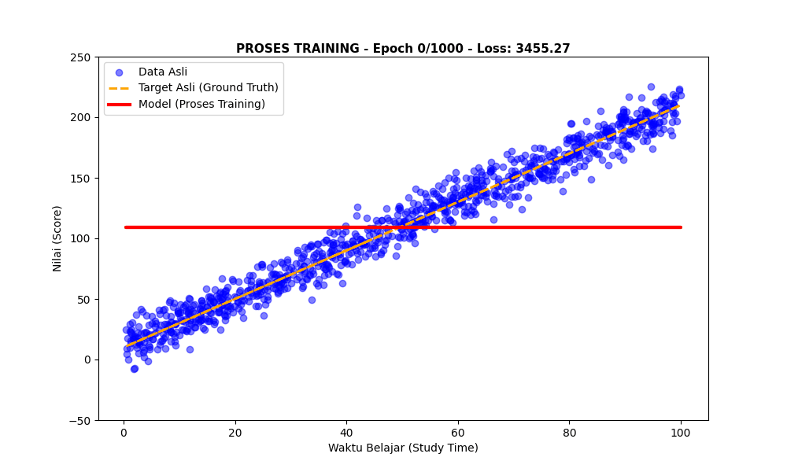
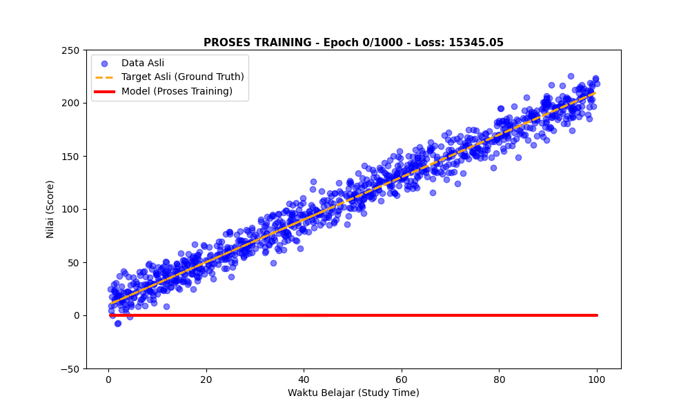

# Linear Regression from Scratch (NumPy Implementation)


## 📌 Project Overview
This project is a fundamental implementation of **Linear Regression** built entirely from scratch using **Python** and **NumPy**. Unlike standard implementations that rely on high-level libraries (e.g., Scikit-Learn), this project manually constructs the mathematical engine behind the model.

The primary objective is to demonstrate a rigorous understanding of the underlying mathematics of Machine Learning, specifically **Calculus (Derivatives)** and **Optimization Algorithms**.

## 🧠 Mathematical Foundations
The core of this project relies on deriving the formulas manually to optimize the line fit.

### 1. The Hypothesis
The model predicts the value $\hat{y}$ using a linear equation:

$$\hat{y} = mx + b$$

* $m$: Slope (Weight)
* $b$: Intercept (Bias)

### 2. The Cost Function (Mean Squared Error)
To evaluate the model's performance, I implemented the MSE formula manually:

$$J(m, b) = \frac{1}{n} \sum_{i=1}^{n} (y_i - (mx_i + b))^2$$

### 3. Gradient Descent (Optimization)
To minimize the error, the parameters ($m$ and $b$) are updated iteratively using partial derivatives (Chain Rule):

$$ m_{new} = m_{current} - L \times \frac{\partial J}{\partial m} $$
$$ b_{new} = b_{current} - L \times \frac{\partial J}{\partial b} $$

Where the gradients are derived as:
*   $\frac{\partial J}{\partial m} = -\frac{2}{n} \sum x(y - \hat{y})$
*   $\frac{\partial J}{\partial b} = -\frac{2}{n} \sum (y - \hat{y})$

---

## 🎥 Training Visualization
The following animations demonstrate the **Gradient Descent** process in action. Observe how the regression line iteratively adjusts its slope and intercept to minimize the distance to the data points.

### Scenario 1: Initializing at Mean
*(Starting the line from the average Y value for faster convergence)*


### Scenario 2: Initializing at Zero
*(Starting from m=0, b=0 to visualize the full learning curve)*


**Legend:**
*   **🔴 Red Line:** The Model ($y = mx + b$) learning in real-time.
*   **🟠 Orange Line:** Ground Truth (The actual underlying pattern).
*   **🔵 Blue Dots:** Sample Data (Generated with Gaussian noise).
*   *Note: Animation speed is dynamically adjusted (slow at start, fast at end) to highlight the initial parameter updates.*

---

## 🛠️ Tech Stack
*   **NumPy:** Matrix operations and mathematical calculations.
*   **Pandas:** Data structure handling.
*   **Matplotlib:** Static and animated visualizations (`FuncAnimation`).

---

## 📂 Project Structure

```text
├── assets/
│   ├── linear_regression_training_process.gif  # Animation output 1  
│   ├── linear_regression_training_process2.gif # Animation output 2   
│   ├── ... (Reference images)
│
├── notebooks/
│   ├── linear_regression_scratch.ipynb         # Main Logic & Derivations
│   ├── linear_regression_scratch.pdf           # PDF version
│
├── requirements.txt                            # Python dependencies
└── README.md                                   # Project Documentation

```

---

## 📚 Learning Resources & References
This project was built based on First Principles thinking. I highly recommend the following resources which guided my implementation:

*   **Logic & Implementation:** [Linear Regression from Scratch in Python](https://www.youtube.com/watch?v=VmbA0pi2cRQ) by *NeuralNine*.
*   **Mathematical Concept:** [Linear Regression, Clearly Explained](https://www.youtube.com/watch?v=nk2CQITm_eo) by *StatQuest with Josh Starmer*.
*   **Derivation Deep Dive:** [GLinear Regression: A Beginner's Guide with Visual Animations & Python Code](https://www.youtube.com/watch?v=GYjSC27-txA) by *Single Cell*.
*   **My Learning Path:** [Mathematics for Machine Learning Repository](https://github.com/Zendin110206/ml-path-to-mastery).

---

*Implementation by [Muhammad Zaenal Abidin Abdurrahman](https://www.linkedin.com/in/zendin1102/) - 2026*
